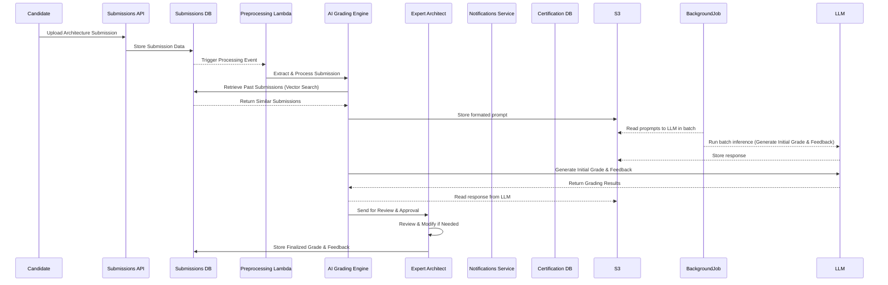
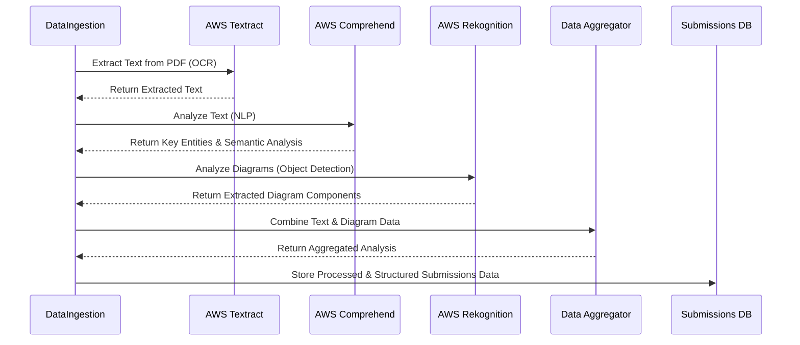
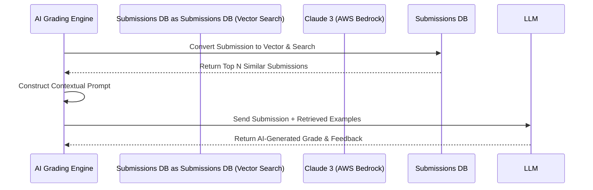
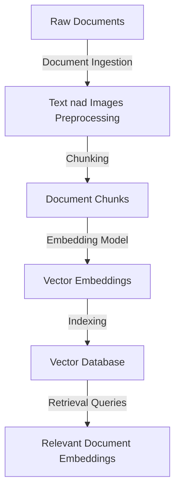
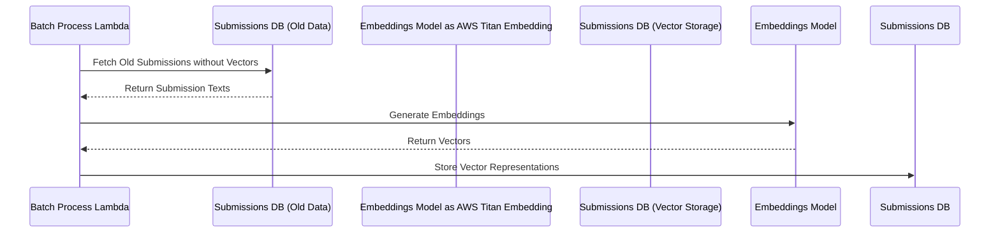

# AI Architecture Submissions processing



### Process Architecture Submission Files and store to DB

Detailed flow for `Preprocessing Lambda` mentioned in general flow

[Data processing AWS Costs](aws_costs.md#2-guardrails-costs-estimation)



### RAG workflow



### Contextual propmt example (Use Bedrock Model Evaluation to adjust prompt)

```
Use case: {USE_CASE}
Candidate's proposed architecture design: {PROCESSED_SUBMISSION}

[Relevant Past Submissions]
1. {HIGH_SCORE_SUBMISSION_EXAMPLE}
2. {LOW_SCORE_SUBMISSION_EXAMPLE}
3. {MEDIUM_SCORE_SUBMISSION_EXAMPLE}

[Grading Metrics]
- Accuracy Criteria: {KNOWLEDGE_BASE_ON_ACCURACY}
- Completeness Criteria: {KNOWLEDGE_BASE_ON_COMPLETENESS}
- Best Practices Compliance: {KNOWLEDGE_BASE_ON_COMPLIANCE}
- Match architecture patterns: {KNOWLEDGE_BASE_ON_ARCHITECTURE_PATTERNS}
```

### Data Indexing and Embeddings


## Backfill old submissions with vector represenatation

To be used as examples.


