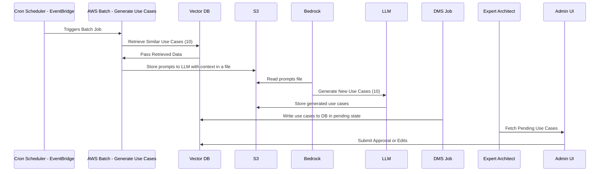
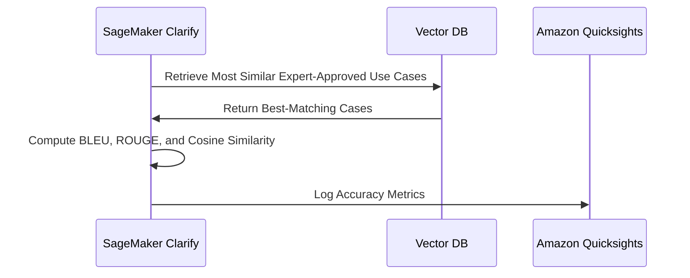

# AI assisted Use Cases generation

Use AI scheduled job generates 10 new Use Cases for Expert review once a week.

## AI Evals. Accuracy and Similiarity

| **Metric** | **Description** |
|------------|----------------|
| **BLEU Score** | Measures text similarity between AI-generated and expert-approved use cases. |
| **ROUGE Score** | Evaluates how much AI-generated use cases overlap with best practices. |
| **Cosine Similarity** | Checks if AI-generated use cases are semantically close to expert cases. |
