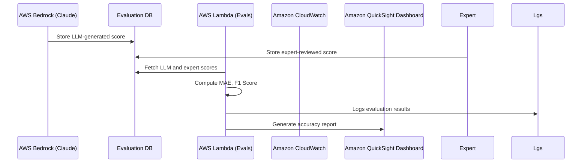

# LLM evaluation pipeline with AWS services

[AWS_COSTS](aws_costs.md)

## 1. LLM vs Experts score benchmark

Metrics:
- **Mean Absolute Error** (MAE) ensures AI scores are aligned with expert grading.
- **F1 Score** tracks AI’s pass/fail prediction accuracy.



## 2. LLM Explanation Relevance Measurement

Metrics:
- Human review scores (Likert scale 1-5) track LLM response usefulness.
- Target: 80% of LLM explanations should receive ≥4 rating from experts.

```mermaid
sequenceDiagram
    participant LLM as AWS Bedrock (Claude)
    participant RAG as Vector DB (RAG Retrieval)
    participant Expert as Expert Software Architect
    participant EvalLambda as AWS Lambda (Evals)
    participant Logs as Amazon CloudWatch
    participant Analytics as AWS Quicksights

    LLM->>RAG: Retrieve best-practice solutions
    LLM->>Expert: Provide grading explanation
    Expert->>EvalLambda: Provide relevance rating (1-5)
    EvalLambda->>Logs: Log human ratings
    EvalLambda->>Analytics: Generate evaluation trends
  ```

## 3. Confidence Calibration & Hallucination Detection

Metrics:
- Brier Score ensures LLM's confidence levels match real grading uncertainty.
- False positives in LLM grading are flagged for improvement.

```mermaid
sequenceDiagram
    participant LLM as AWS Bedrock (Claude)
    participant EvalLambda as AWS Lambda (Evals)
    participant Logs as Amazon CloudWatch
    participant Analytics as AWS Quicksights

    LLM->>EvalLambda: Provide confidence score (0-1)
    EvalLambda->>EvalLambda: Compute Brier Score
    EvalLambda->>Logs: Log calibration accuracy
    EvalLambda->>Analytics: Display model confidence vs. actual correctness
```
