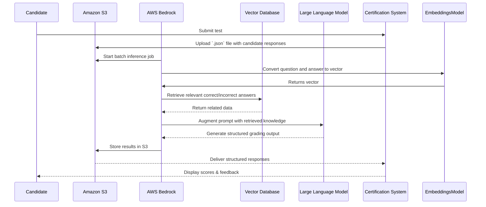

# Short Answers Grading

## Use RAG
To effectively grade short-answer responses in a software architecture certification system, it’s essential to provide the LLM with relevant context from a vector database containing correct and incorrect answers. 
This approach enhances the accuracy of evaluations and ensures personalized feedback.

## Related ADRs
- [use instrctor adr](adrs/use_instructor.md)
- [use_aws_cloud](adrs/use_aws_cloud.md)



1. **System Format Candidate Responses:**
   Structure responses in a JSON Lines file with:
  - `recordId`: Unique identifier.
  - `modelInput`: 
    - `prompt`: The original question.
    - `candidate_response`: The candidate's answer.

**Example Entry:**
```json
{
    "recordId": "1",
    "modelInput": {
        "prompt": "Define 'microservices architecture'.",
        "candidate_response": "It's a design approach where a system is divided into small, independent services."
    }
}
```
2. Data storage (upload to s3)
3. Batch Inference Job Submission with RAG
   - select model
   - input s3 bucket
   - output s3 bucket
   - configure Bedrock access to Vector DB
4. Contextual Retrieval:
	 - Convert the prompt into a vector.
	 - Perform similarity search in the vector database.
   - Rank and filter non relevant data
	 - Retrieve most relevant correct and incorrect answers.
5. LLM Evaluation:
   - Augment prompt with retrieved knowledge.
   - Generate structured output with: ```question, candidate_response, is_correct, feedback, correct_answer.```
**Example Respose:**
```json
{
    "recordId": "1",
    "modelInput": {
        "prompt": "Define 'microservices architecture'.",
        "candidate_response": "It's a design approach where a system is divided into small, independent services."
    },
    "modelOutput": {
        "question": "Define 'microservices architecture'.",
        "candidate_response": "It's a design approach where a system is divided into small, independent services.",
        "is_correct": true,
        "feedback": "Correct. Microservices architecture consists of small, autonomous services communicating over APIs, enhancing scalability.",
        "correct_answer": "Microservices architecture consists of small, autonomous services communicating over APIs."
    }
}
```
6. AWS Lambda triggerd on new upload to output s3 bucket
   - process response
   - calculate grading
   - provide feedback to Candidate

By integrating RAG into your batch inference workflow, the LLM can access a curated set of correct and incorrect answers, leading to more accurate and consistent grading outcomes. 
This method leverages AWS Bedrock’s capabilities to enhance the efficiency and scalability of your software architecture certification system
