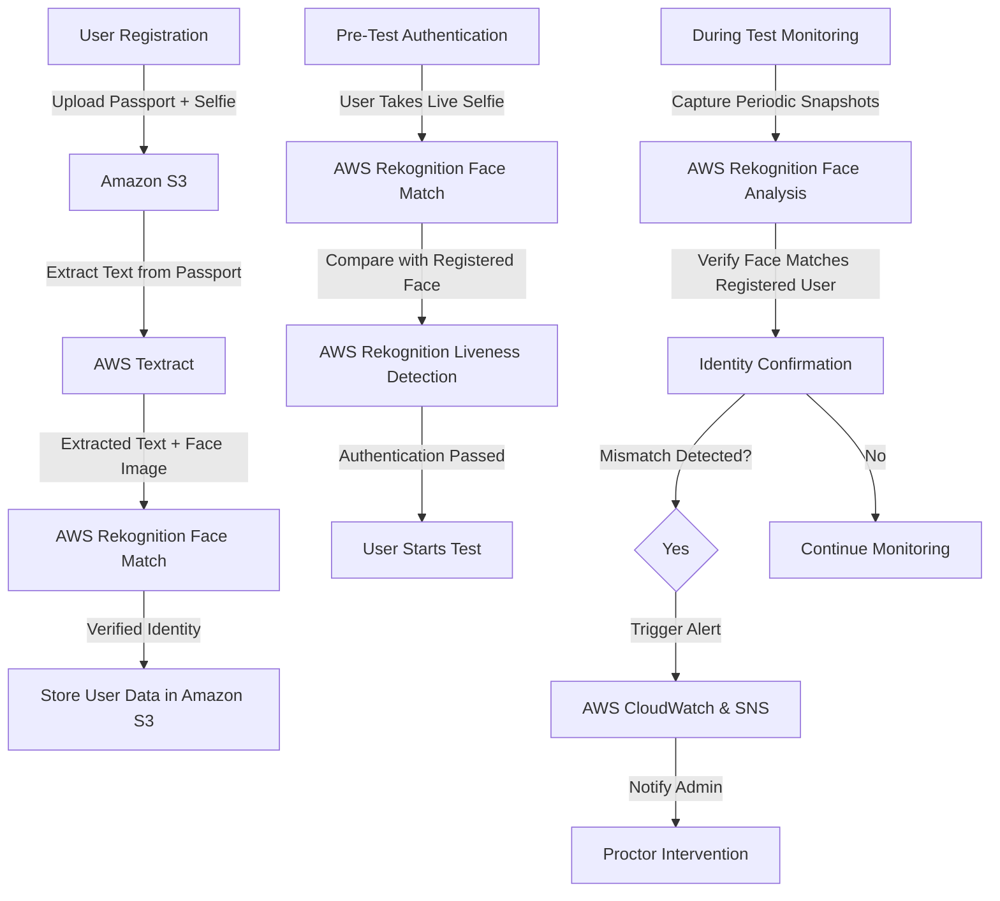

# Face Recognition AI for fraud prevention

## Flow diagrams

## Technology Stack

| **Component**         | **Technology Used** |
|----------------------|--------------------|
| **Face Recognition** | AWS Rekognition |
| **ID Verification**  | AWS Textract |
| **Liveness Detection** | AWS Rekognition Face Analysis |
| **Storage & Security** | Amazon S3 (for images) + AWS KMS (encryption) |
| **Monitoring & Alerts** | AWS CloudWatch, SNS, Lambda |
