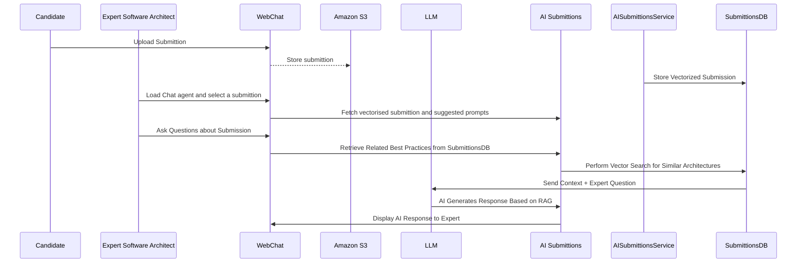
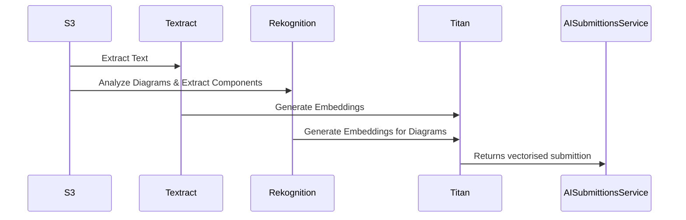

### Note: Not possible to calculate costs, since each expert can ask different number and type of questions. Consider to use automatic grading and summarisation, based on existed best practices, graded submittions with RAG




## Analyse submittion



## AI Capabilities for the Architect. 

Personalised prompt suggestions for each Case Studyavailable to Expert Architect in the WebApp interface.

### 1. Explain Architectural Concepts
	•	“How well does this submission follow the CQRS pattern?”
	•	“Does this design handle fault tolerance effectively?”

### 2. Compare with Best Practices
	•	“Show me a past high-quality submission for a similar case study.”
	•	“What are the most common mistakes candidates make in microservices?”

### 3. Provide Suggestions for Expert Grading
	•	“Does this solution properly handle data consistency?”
	•	“What are potential areas for improvement in this design?”

 ## Prompt templates

### A. Submission Evaluation Prompt
 ```
You are an AI assistant helping an expert software architect grade a candidate’s software architecture submission.

### Candidate Submission:
{EXTRACTED_TEXT_HERE}

### Reference to original submittion files:
{ORIGINAL_FILES_SIGNED_URL}

### Best-Practice Reference Submissions:
{RAG_CONTEXT_HERE}

### Expert's Question:
{USER_QUESTION_HERE}

### Expected Response Format:
- **Assessment:** (Explain how the submission aligns with best practices)
- **Strengths:** (List key strong points)
- **Weaknesses:** (Identify areas that need improvement)
- **Suggested Feedback:** (Provide recommendations the expert might give to the candidate)

Only provide guidance. The final grading decision is made by the expert.
```

B. Architecture Pattern Compliance Prompt

```
Evaluate whether the candidate’s software architecture submission follows the **{PATTERN_NAME}** pattern.

### Candidate Submission:
{CANDIDATE_SUBMISSION}

### RAG Retrieved High-Quality Submissions:
{BEST_PRACTICE_REFERENCES}

### Expected Response:
- **Does the submission follow {PATTERN_NAME}?** (Yes/No + Explanation)
- **What improvements could be made to better align with {PATTERN_NAME}?**
```

C. Expert Feedback Guidance Prompt
```
Generate **grading feedback** for an expert software architect based on the candidate's submission.

### Candidate Submission:
{CANDIDATE_SUBMISSION}

### Expert’s Initial Observations:
{EXPERT_NOTES}

### Best-Practice Submissions (RAG):
{TOP_3_SIMILAR_ARCHITECTURES}

### Response Format:
- **Does the submission align with best practices?** (Yes/No + Explanation)
- **Key strengths of the submission**
- **Key areas of improvement**
- **Recommended feedback for the candidate**
```
