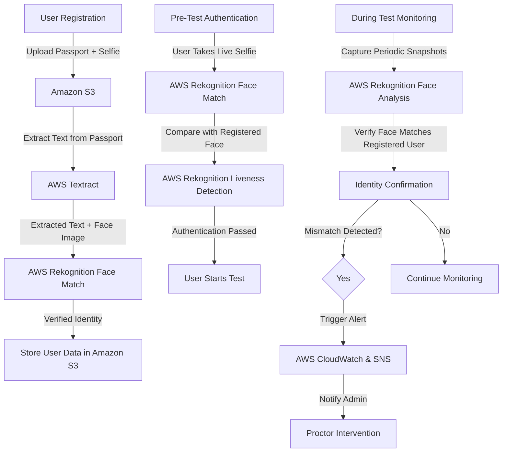

# Face Recognition ML for fraud prevention

## Flow diagrams

## Technology Stack

| **Component**         | **Technology Used** |
|----------------------|--------------------|
| **Face Recognition** | Amazon Rekognition Face Detection, Amazon Rekognition Face Comparison |
| **ID Verification**  | Amazon Rekognition Object Detection, Amazon Rekognition Text Detection, Amazon Rekognition Custom Labels |
| **Liveness Detection** | Amazon Rekognition Face Liveness  |
| **Detect duplicate users** | Amazon Rekognition Face Index |
| **Storage & Security** | Amazon S3 (for images) + AWS KMS (encryption) |
| **Monitoring & Alerts** | AWS CloudWatch, SNS, Lambda |

Solution template: https://aws.amazon.com/rekognition/identity-verification/
