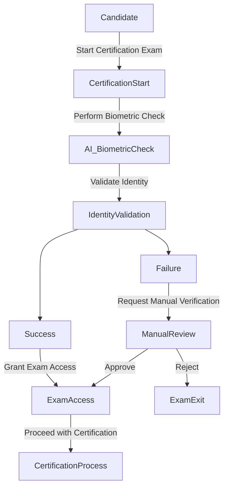
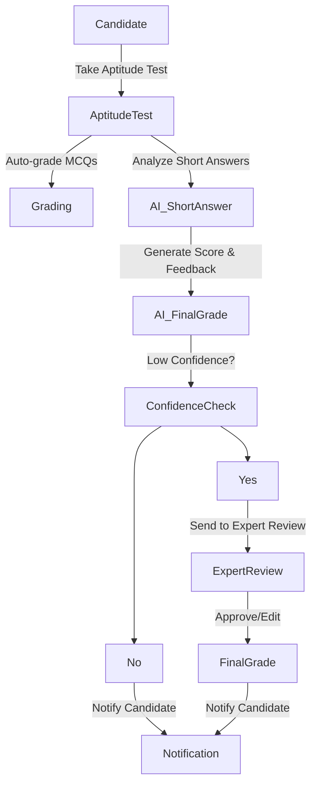
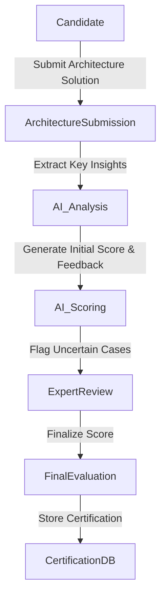

# AI-Driven Use Cases

## Overview
This document outlines the AI-driven use cases that will be integrated into the existing certification system. The focus is on automation, cost-efficiency, and reducing expert workload while maintaining grading accuracy.

## Use Cases

| ID   | Use Case Name | Description | Actor(s) | Related Constraints |
|------|--------------|-------------|---------|----------------------|
| UC-1 | **AI Batch Grading for Short-Answer Questions** | AI processes short-answer responses in **batches** to optimize costs while maintaining the one-week grading SLA. | AI System, Expert Software Architect | C-4 |
| UC-2 | **Manual Review of AI-Graded Short-Answer Questions** | Expert software architects review low confident answers to ensure accuracy and adjust if necessary. | Expert Software Architect | C-5, C-9 |
| UC-3 | **AI-Assisted Review of Architecture Submissions** | AI pre-processes architecture submissions to highlight key areas for expert review, ensuring faster manual grading. | AI System, Expert Software Architect | C-4, C-5 |
| UC-4 | **Manual Review of AI-Processed Architecture Submissions** | Experts finalize grading and provide candidate feedback after reviewing AI-processed evaluations. | Expert Software Architect | C-5, C-9 |
| UC-5 | **AI-Driven Test Performance Analytics** | AI analyzes historical test data to detect problematic questions, identify grading inconsistencies, and suggest content improvements. | AI System, Expert Software Architect | C-3, C-9 |

## AI Use Case Diagrams

### Candidate Registration

### AI in Aptitude Test Grading

### AI in Architecture Submission Evaluation

## Related Documents
- [Constraints](constraints.md)

[Back to Index](README.md)
